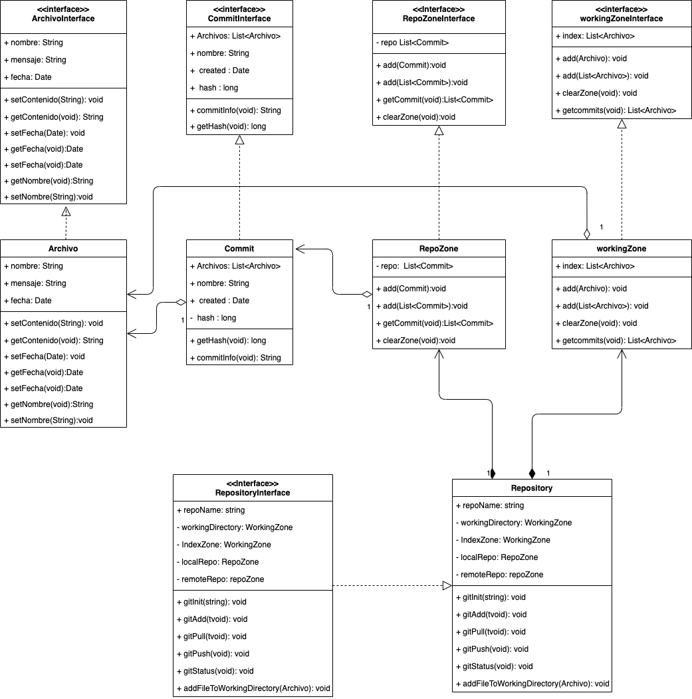
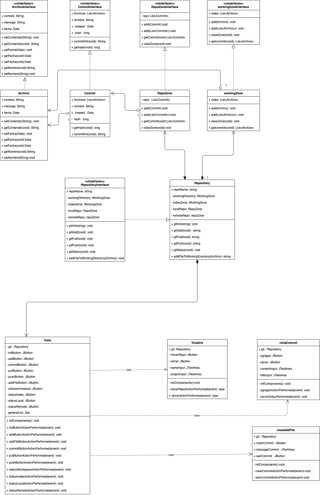

\newpage 

# Indice

1. Introduccion.
2. Descripcion del problema.
3. Descripción del paradigma.
4. Análisis del problema.
5. Diseño de la solución.
6. Aspectos de la implementación.
7. Instrucciones de uso.
7. Resultados y Autoevalución.
8. Conclusiones.
9. Referencias.

\newpage

# Introducción

Los Paradigmas de programación son modelos o patrones de trabajo, los cuales nos permiten resolver problemas abordando de distintas manera la ejecución de la solución.

Es preciso señalar que indiferente de los lenguajes nuevos, modernos y sus herramnientas propias asociadas, siempre se regirán por al menos uno o más paradigmas de programación. Pues son estos quienes nos permiten analizar de buena manera.

### Objetivos generales

Para este laboratorio se plantea crear una pieza de software dentro del paradigma de programación orientado a eventos que tome lo desarrollado en el informe anterior para realizar una interfaz que permita interactuar con la simulación de un "controlador de versiones" como lo es GIT.

### Objetivos especificos

Para abordar el problema se plantean lo siguientes objectivos especificos

* Diseño de la solución.
* Aspectos de la implementación.
* Instrucciones de uso.
* Resultados y Autoevalución.
* Conclusiones.

\newpage

# Descripción del problema

La necesidad de mantener y producir software escalable, ordenado y mantenible durante el tiempo es una cuestión importante dentro de la industria. Poder llevar todos los cambios asociados a un proyecto, trabajado por un grupo importante de personas y todo lo que conlleva el manejo de errores es parte de lo que resuelven los software denominados "controladores de versiones".

Para el problema en cuestión se requiere de una pieza de software que permita realizar las siguientes acciones dentro de un directorio de trabajo, independiente del trabajo realizado dentro de este:

* implementar una interfaz de usuario que permita interactuar con los distintos estados de git

* iniciar un repositorio desde cero.

* ver los status de cada zone de trabajo con botones que accedan a estos.

* realizar cada acción pertinente a los laboratorios de git anteriores (init, add, commit, push, pull, agregar archivo ).

\newpage

# Descripción del paradigma

El "paradigma orientado a eventos" es un paradigma que se centra (como su nombre lo indica) en la detección de eventos. El "evento" es la unidad principal de este y se entiente por evento a una acción o ocurrencia que el programa puede detectar y manejar a anotojo. Estos eventos pueden disparar otras acciones ya sean sincronas o asincronas dentro de la ejecución de nuestro programa.

Para poder diferenciar mejor las entidades que componen a este paradigma podemos diferencias los siguientes puntos:

* Evento : Unidad principal dentro del paradigma, es la acción o reacción de un usuario o maquina. la cual dispara el evento en cuestión.

* manejador de eventos: Es una subrutina que se ejecuta tras la llamada de un evento especifico. Esta subrutina es un trozo de codigo que toma el evento y lo maneja, realizando una acción especifica asociada al evento, Ejemplo(click de un boton, lectura de un sensor).

* Delegado: Los delegados son estructuras que podemos apreciar en algunos lenguajes y que hacen referencia a nivel de memoria a una funcion que se ocupa como un "callback" o para realizar eventos personalizados.

* Excepción: las excepciones son estructuras de codigo que nos permiten manejar posibles errores que puedan ocurrir en tiempo de ejecución al momento de manejar eventos o subrutinas asociados a eventos. Estas excepciones pueden ser manejadas y aisladas para entregar errores entendibles y poder continuar con flujos de trabajo sin mayor impacto de cara al usuario.

En general los lenguajes que implementan este paradigma poseen eventos ya predefinidos, generalemente asociados a acciones realizadas por el usuario, sistema o el hardware donde es utilizado el programa en cuestión.

\newpage

# Analisis del problema

Para el problema en cuestion se han dispuesto de dos packetes principales, uno orientado a las vistas y otro orientado al modelo, estos paquetes conforman el proyecto, las vistas se encargan de la presentación y tienen total dominio del modelo, a su vez el modelo solo se encarga de realizar las acciones asociadas al manejo de la información y se desentienden del modelo como tal, los elementos subdividos son:

* vista:
  * vista: vista principal que se encarga de mostrar las funcionalidades asociadas al modelo general 
  * vistaInit: vista asociada al iniciar un nuevo modelo, toma como entradas el nombre del usuario y el nombre del repositorio
  * vistaAddFile: vista asociada a la creación de un archivo, toma como entradas el nombre del archivo y el contenido de este
  * vistaCommit: vista asociada a la creacion de un commit, toma como entrada el comentario asociado al commit
  
Dentro de la vista principal tenemos eventos y sus distintos manejadores a través de botones, estos se encargan de implementar los estados correspondientes al flujo de del modelo asociado que mencionaremos a continuación:

* modelo:
  * WorkingDirectory: Espacio de trabajo donde agregaremos los archivos que queramos agregar como cambios en nuestro flujo de trabajo principal.
  * IndexZone: Espacio de trabajo donde se preparan los archivos que están listos para ser enviados al nuestra rama de trabajo y que cuentan como cambio oficial dentro
  de nuestro flujo de trabajo mencionado.
  * Local Repository: Espacio de trabajo donde se encuentran nuestros cambios locales, no compartidos con el equipo de trabajo en su totalidad.
  * Remote Repositoyry: Espacio de trabajo donde se guardan nuestros cambios globales, estos son compartidos en su totalidad por el equipo de trabajo que utiliza el     espacio en cuestión.

A su vez se define una unidad llamada "Commit", el commit es una entidad que contiene todos los archivos que asociados a un cambios dentro de nuestro trabajo, junto con un mensaje,meta datos y la información correspondiente a la persona que hizo este cambio. Estos commits solo se encuentran en dos espacios de trabajo los cuales son "Local Repository" y "Remote Repository". 

A su vez se desprende la unidad de "Archivo", el "archivo" es la unidad de minima dentro de un commit y como su nombre lo indica es donde nosotros trabajamos y realizamos cambios en nuestro proyecto en cuestion.

\newpage

# Diseño de la solución

Para el diseño de nuestra solución tenemos los siguiente diagrama de UML que muestra la relación de nuestras clases, antes de implementar el paradigma orientado a eventos y después de su implementación: 

\newpage

\newpage

Tenemos cinco clases principales asociadas al modelo que implementan sus interfaces correspondientes para una mayor comprension entre el contrato que tienen con el diseño, estas son :

* Archivo: Clase que representa un archivo de texto plano dentro de la simulación creada.

* Commit : Clase que representa un cambio dentro de nuestro flujo del trabajo dentro de la simulación. Esta Contiene una Lista de Archivos ya actualizados o agregados en la rama de trabajo.

* WorkingZone: Clase que tiene como objetivo representar las dos primeras estaciones de trabajo de la simulación. "WorkingDirectory" e "Index". Estas áreas solo manejan archivos entre sí y representan los estados de trabajo en progreso y teminado en la simulación.

* RepoZone: Clase que tiene como objetivo representar las siguientes dos estaciones de trabajo de la simulación. "Local Respository" y "RemoteRepository". Estas áreas manejan los commits que se guardan como cambios en el flujo de trabajo de un proyecto. 

*Repository : Clase principal que contiene a las otras zonas, permite agregar archivos al "workingDirectory", moverlos al "index", crear commits para el "local Repository" y subir los cambios al "Remote Repository", además de mostrarnos los estados de cada zona en cuestión.

Para la vista tenemos cuatro clases principales que conforman la interfaz de usuario final y contienen las interacciones necesarias para llevar a cabo el uso correspondiente del modelo, estas son:

* Vista : Clase que tiene como objetivo la construcción de la interfaz principal de usuario, creando todos los botones y sus respectivos eventos asociados a cada proceso del modelo.

* VistaInit : clase implementada en Vista que tiene como objetivo crear una interfaz simple para hacer gitInit dentro del flujo del modelo.

* VistaAddFile : clase implementada en Vista que tiene como objetivo crear una interfaz simple para hacer addFile al workspace del flujo del modelo.

* VistaCommit : clase implementa en vista que tiene como objetico crear una interfaz simple para crear un commit y agregarlo al localRepository del flujo del modelo

\newpage

# Aspectos de la implementación

Nuestro programa contiene 3 package principales los cuales a su vez se subdividen en packages secundarias que nombraremos a continuación:

* modelo:
  * archivo: Contiene la interface de "Archivo" y la definición de clase del mismo.

  * commit : Contiene la interace de "Commit" y la definción de clase del mismo.

  * repozone: Contiene la interface "RepoZone" y la definición de clase del mismo.

  * workingzone: conitene la interface de "WorkingZone" y la definición de clase del mismo.

  * repository: Contiene la interface de "Repository" y la definición de clase del mismo.

* Vista : Contiene una clase principal y 3 subclases que actuan como dependencias a esta.

* laboratorio4(main) : clase que construye nuestra Vista principal y nos permite interactuar con esta.

A su vez todo el codigo fuente se concentra en el directorio "src" dentro del directorio "lab3". Se han ocupado librerías propias del lenguaje para trabajar de mejor manera cada una de las clases ya mencionadas. esta librerías son.

* Date: librería para manejor del tiempo ordenado, utilizado en archivos y commits.

* List: librería para el manejo de listas de cualquier tipo de elemento asociado a estas.

* Instant: libreria utilizada dentro de Commit para crear un hash con respecto al momento en el que este es creado.

* Swing : Librería principal para la construcción de la interfaz de usuario, sus subclases y componentes nos permiten manejar y sobreescribir los eventos correspondientes para poder hacer uso del paradigma orientado a eventos de manera eficaz

El proyecto fue creado en un equipo macOS, la que a su vez utilizó como base java version "1.8.0_111". Otros directorios y archivos como "nbproject" y build.xml forman parte del "ide" utilizado en primera instancia para trabajar en este proyecto pero no son requeridos para poder ejecutarlo. 

\newpage

# Instrucciones de uso

Al ejecutar el programa principal se desplegará una interfaz grafica con distintos botones, cada uno de ellos indicando su funcionalidad correspondiente. La interfaz principal se ha divido en dos sectores principales, el menú de status de zonas y el menu de estados de GIT, además de un lista donde se mostrarán los estados o commits al momento de clickearse algún estado correspondiente, para iniciar la simulación desde cero primero debemos dara click a gitInit, este nos desplegará otra ventana y nos permitirá crear un repository nuevo, cabe destacar que hacer al hacer esto se perderán los datos del repositorio previamente creado. Ninguna funcionalidad se activará hasta crear un repo de manera correcta.

\newpage

# Resultados y Autoevaluación

A continuación se listarán los requerimientos completados como resultado de la creación de este simulación.

| requerimiento | completado | grado de completacion |
| -- | -- | -- |
| gitInit | si | 100% |
| gitAdd | si | 100% |
| gitCommit | si | 100% |
| gitPush | si | 100% |
| gitPull | si | 100% |
| statusWorkspace | si | 100% |
| statusIndex | sí | 100% |
| statusLocalRepository | sí | 100% |
| statusRemoteRepository | sí | 100% |

todos los requerimientos funcionales se han cumplido para este laboratorio, respetando el uso del paradigma correspondiente y sus utilidades, un caso no probado sí  es el de gitPull cuando el RemoteRepository supera a en commits al LocalRepository a pesar de que se encuentra el codigo disponible para ello.

\newpage

# Conclusiones

Después de terminar con las pruebas correspondientes y ejecución del codigo podemos concluir que la pieza de software emula en su totalidad con lo requerido por el laboratorio en cuestión. Utilizando el paradigma de programcion orientado a objetos como marco de trabajo. Una vez analizado este informe, y tomando las indicaciones realizadas para poder ejecutar el programa. Se puede apreciar que el paradigma utilizado nos permite modelar de manera eficiente cada una de las partes que constituyen el problema explicado.

El paradigma orientado a eventos nos muestra una nueva perspectiva en terminos de solución a problemas, pues prioriza las interacciones y los eventos que se ven envueltos para actuar conforme a estos. a pesar de qué nos apoyamos en el paradigma anterior para manejar de forma eficiente ambos, podemos indicar que la mayor diferencia entre ambos son la estructura en torno al cómo mostrar describir nuestro TDA y el cómo ambos modelan estos. sin duda el paradigma orientado a eventos está mucho más asociado a responder a problemas de caracter asincrono y no estructurado del todo. pues este escucha los eventos asociados a sensores y solo en ese momento, ejecuta las subrutinas correspondiente, a diferencia del POO que nos permite modelar de manera ordenada una objeto y cómo este se comporta, sabiendo su comportamiento de ante mano.

\newpage

# Referencias

Para el desarrollo de este proyecto se han ocupado las siguientes fuentes o libros:
  
* Christos G. Cassandras (2014) The event-driven paradigm for control, communication and optimization, Journal of Control and Decision, 1:1, 3-17, DOI: 10.1080/23307706.2014.885288

* Schildt, Herbert. Java: The Complete Reference, Eleventh Edition. New York: McGraw-Hill Education, 2018.

